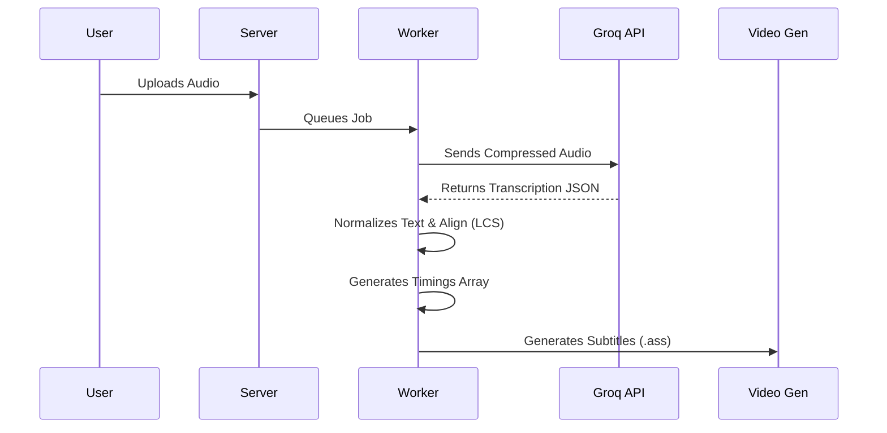

# Quran Video Maker (QVM) - Documentation

## Table of Contents
- [Project Overview](#project-overview)
- [System Architecture](#system-architecture)
- [Installation & Setup](#installation--setup)
- [Configuration](#configuration)
- [Core Components](#core-components)
- [Authentication & User Accounts](#authentication--user-accounts)
- [Email System](#email-system)
- [Database Layer](#database-layer)
- [Caching Layer](#caching-layer)
- [Security](#security)
- [API Reference](#api-reference)
- [Frontend Structure](#frontend-structure)
- [Video Generation Pipeline](#video-generation-pipeline)
- [Storage & Cloud Integration](#storage--cloud-integration)
- [Synchronization Systems](#synchronization-systems)
- [Job Queue & Background Processing](#job-queue--background-processing)
- [Troubleshooting](#troubleshooting)
- [Development Guidelines](#development-guidelines)
- [Future Roadmap](#future-roadmap)

## Project Overview

Quran Video Maker (QVM) is a full-stack web application designed to create professional-quality videos of Quranic verses with synchronized audio, customizable visual styling, and intelligent background generation. The system combines multiple APIs, AI-powered synchronization, and cloud-native architecture to deliver a seamless video creation experience.

### Key Capabilities
- **Multi-Format Output**: Generate videos in horizontal (16:9) and vertical (9:16) formats
- **Multi-Source Audio**: Built-in reciter library or custom audio uploads
- **Intelligent Backgrounds**: AI-generated backgrounds based on verse meaning or user-provided media
- **Advanced Synchronization**: Both AI-powered automatic sync and manual tap-to-sync interfaces
- **Multi-Language Support**: Display Arabic text with translations and transliterations
- **Typography Control**: Customizable fonts, colors, sizes, and positioning
- **Cloud-Native**: Stateless architecture with Cloudflare R2 storage
- **Queue-Based Processing**: Robust job queuing for resource-intensive video rendering
- **User Accounts**: JWT-based authentication with per-user video galleries
- **Email Verification**: Resend-powered email verification and password reset flows
- **Account Management**: Password reset, email verification, and account deletion
- **Security Hardened**: Rate limiting, CORS whitelisting, input validation, path traversal prevention
- **Turso Database**: Cloud-capable Turso/libsql database with local SQLite fallback
- **Redis Caching**: Optional caching layer for API responses with graceful degradation

## System Architecture

### High-Level Overview
```
┌─────────────────┐    ┌─────────────────┐    ┌─────────────────┐
│   Client        │    │   Express       │    │   Redis         │
│   (Browser)     │◄──►│   Server        │◄──►│   Queue/Cache   │
│   + Auth UI     │    │   (index.js)    │    │   (BullMQ)      │
└─────────────────┘    └────────┬────────┘    └─────────────────┘
                                │
                    ┌───────────┼───────────┐
                    │           │           │
             ┌──────▼──────┐ ┌─▼────────┐ ┌▼────────────────┐
             │   Cloud     │ │ SQLite   │ │   Worker        │
             │   Storage   │ │ Database │ │   Process       │
             │   (R2/S3)   │ │ (Users/  │ │   (worker.js)   │
             └─────────────┘ │  Videos) │ └─────────────────┘
                             └──────────┘         │
                                           ┌──────▼──────┐
                         ┌─────────────┐   │   FFmpeg    │
                         │   External  │   │   Engine    │
                         │   APIs      │   │             │
                         │   (Quran,   │   └─────────────┘
                         │   Unsplash) │
                         └─────────────┘
```

### Technology Stack
- **Frontend**: HTML5, CSS3, Vanilla JavaScript (ES6 Modules)
- **Backend**: Node.js, Express.js
- **Authentication**: JWT (jsonwebtoken) + bcrypt password hashing
- **Email**: Resend API (transactional emails for verification & password reset)
- **Database**: Turso/libsql (`@libsql/client`) with local SQLite fallback
- **Queue System**: BullMQ with Redis
- **Caching**: Redis (ioredis) with graceful degradation
- **Cloud Storage**: Cloudflare R2 (S3-compatible)
- **Video Processing**: FFmpeg (with hardware acceleration support)
- **AI Synchronization**: Groq API (Whisper Large v3)
- **External APIs**: Al-Quran Cloud, MP3Quran, Unsplash
- **Process Management**: PM2 (production)
- **Package Management**: npm

## Installation & Setup

### Prerequisites
```
Node.js v16+        # JavaScript runtime
FFmpeg v5+          # Video processing
Redis v6+           # Job queue
FontConfig          # Arabic font rendering
Docker (optional)   # Containerized deployment
```

### Method 1: Docker Deployment (Recommended)
```bash
# 1. Clone repository
git clone https://github.com/modhtom/QVM.git
cd QVM

# 2. Create environment file
cat > .env << EOF
UNSPLASH_ACCESS_KEY=your_unsplash_key_here
UNSPLASH_SECRET_KEY=your_unsplash_secret_here
R2_ENDPOINT=https://<account_id>.r2.cloudflarestorage.com
R2_ACCESS_KEY_ID=your_access_key_id
R2_SECRET_ACCESS_KEY=your_secret_access_key
R2_BUCKET_NAME=qvm-videos
R2_PUBLIC_URL=https://pub-<id>.r2.dev
GROQ_API_KEY=your_groq_api_key
REDIS_HOST=redis
EOF

# 3. Start services
docker compose up --build
```

### Method 2: Local Development Setup
```bash
# 1. Install system dependencies
# Ubuntu/Debian
sudo apt-get install ffmpeg fontconfig redis-server

# macOS
brew install ffmpeg fontconfig redis

# 2. Install Node.js dependencies
npm install

# 3. Configure environment
cp .env.example .env
# Edit .env with your API keys

# 4. Start Redis
redis-server &
# OR using Docker
docker run -d -p 6379:6379 --name qvm-redis redis

# 5. Start services
# Option A: Start server and worker separately
node index.js &          # Main Express server
node worker.js &         # Video processing worker

# Option B: Use npm script
npm run start           # Runs both processes
```

### Font Installation
```bash
# 1. Create fonts directory
mkdir -p fonts

# 2. Download required Arabic fonts (e.g., Tasees, Amiri)
# Place .ttf or .otf files in the fonts/ directory

# 3. Register fonts with FontConfig
fc-cache -fv
```

## Configuration

### Environment Variables
| Variable | Description | Required | Default |
|----------|-------------|----------|---------|
| `UNSPLASH_ACCESS_KEY` | Unsplash API access key for background images | Yes | - |
| `UNSPLASH_SECRET_KEY` | Unsplash API secret key | Yes | - |
| `R2_ENDPOINT` | Cloudflare R2 endpoint URL | Yes | - |
| `R2_ACCESS_KEY_ID` | R2 access key ID | Yes | - |
| `R2_SECRET_ACCESS_KEY` | R2 secret access key | Yes | - |
| `R2_BUCKET_NAME` | R2 bucket name for video storage | Yes | - |
| `R2_PUBLIC_URL` | Public URL for accessing stored videos | Yes | - |
| `GROQ_API_KEY` | Groq AI API key for auto-sync | Yes | - |
| `JWT_SECRET` | Secret key for JWT token signing | Yes | - |
| `RESEND_API_KEY` | Resend API key for transactional emails | No | - (emails disabled if not set) |
| `EMAIL_FROM` | Sender address for outgoing emails | No | `QVM <onboarding@resend.dev>` |
| `APP_URL` | Public URL of the app (used in email links) | No | `http://localhost:7860` |
| `TURSO_DATABASE_URL` | Turso cloud database URL | No | `file:Data/db/qvm.db` (local SQLite) |
| `TURSO_AUTH_TOKEN` | Turso authentication token | No | - |
| `REDIS_HOST` | Redis server hostname | No | 127.0.0.1 |
| `REDIS_PORT` | Redis server port | No | 6379 |
| `REDIS_PASSWORD` | Redis server password | No | - |
| `REDIS_URL` | Full Redis connection URL (overrides host/port) | No | - |
| `ALLOWED_ORIGINS` | Comma-separated list of allowed CORS origins | No | http://localhost:3001 |
| `PORT` | Express server port | No | 3001 |

### Directory Structure
```
QVM/
├── Data/                          # Application data
│   ├── audio/                     # Audio files
│   │   ├── cache/                 # Cached recitation audio
│   │   └── custom/                # User-uploaded audio
│   ├── db/                        # SQLite database files
│   │   └── qvm.db                 # Main database (users, videos)
│   ├── text/                      # Quran text and translations
│   ├── subtitles/                 # Generated subtitle files
│   ├── Font/                      # Custom Arabic fonts (.ttf)
│   ├── Background_Video/          # Background media
│   │   └── uploads/               # User-uploaded backgrounds
│   ├── temp/                      # Temporary processing files
│   └── temp_images/               # Temporary image files
├── Output_Video/                  # Final video output (local)
├── public/                        # Frontend static files
│   ├── js/                        # JavaScript modules
│   │   ├── auth.js                # Frontend authentication module
│   │   ├── main.js                # App state & navigation
│   │   ├── fullVideo.js           # Full surah form handler
│   │   ├── partialVideo.js        # Partial video form handler
│   │   ├── videoFormHelpers.js    # Shared form utilities
│   │   └── videos.js              # Gallery management
│   ├── styles/                    # Stylesheets
│   └── index.html                 # Main HTML file
├── utility/                       # Core utilities
│   ├── auth.js                    # JWT authentication middleware
│   ├── authRoutes.js              # Auth API routes (register/login)
│   ├── db.js                      # SQLite database layer
│   ├── cache.js                   # Redis caching layer
│   ├── config.js                  # Configuration management
│   ├── data.js                    # Quran data fetching
│   ├── background.js              # Background generation
│   ├── subtitle.js                # Subtitle generation
│   ├── autoSync.js                # AI synchronization
│   ├── storage.js                 # Cloud storage operations
│   ├── email.js                   # Resend email integration
│   ├── delete.js                  # Cleanup utilities
│   └── fetchMetaData.js           # Metadata fetching script
├── index.js                       # Express server
├── worker.js                      # BullMQ worker
├── video.js                       # Video generation logic
├── ecosystem.config.cjs           # PM2 process configuration
├── Dockerfile                     # Multi-stage Docker build
├── compose.yaml                   # Docker Compose services
└── package.json                   # Dependencies
```

## Core Components

### 1. Express Server (`index.js`)
**Purpose**: Main web server handling HTTP requests, file uploads, and API endpoints.

**Key Features**:
- RESTful API for video operations
- File upload handling with Multer
- Static file serving
- Job queue integration
- Real-time progress updates via Server-Sent Events

**Key Endpoints**:
- `POST /upload-audio` - Upload custom recitation
- `POST /upload-background` - Upload background media
- `POST /generate-{partial,full}-video` - Queue video generation
- `GET /job-status/:id` - Check job status
- `GET /api/videos` - List generated videos
- `DELETE /api/videos/*` - Delete videos

### 2. Video Processing Worker (`worker.js`)
**Purpose**: Background worker processing video generation jobs from Redis queue.

**Key Features**:
- Job lifecycle management (pending, active, completed, failed)
- Progress tracking and reporting
- Error handling and retry logic
- Integration with video generation pipeline

**Configuration**:
- Concurrency: 1 job at a time (configurable)
- Lock duration: 10 minutes per job
- Automatic failure handling with error logging

### 3. Video Generation Engine (`video.js`)
**Purpose**: Core video rendering logic combining audio, text, and visuals.

**Key Functions**:
- `generateFullVideo()` - Generate entire surah video
- `generatePartialVideo()` - Generate video for verse range
- Hardware acceleration detection (NVENC, VideoToolbox, etc.)
- Automatic Bismillah insertion for appropriate surahs

**Processing Steps**:
1. Audio acquisition (API or custom upload)
2. Text fetching (Arabic + translations)
3. Background preparation
4. Subtitle generation with timing
5. FFmpeg rendering with optimal encoder selection
6. Cloud upload and cleanup

### 4. Data Management (`utility/data.js`)
**Purpose**: Fetch and manage Quranic text, audio, and metadata.

**Features**:
- Dual API support (Al-Quran Cloud and MP3Quran)
- Audio caching for performance
- Multi-language text retrieval
- Duration calculation for timing

**API Integration**:
- Al-Quran Cloud: Text, translations, and audio
- MP3Quran: Alternative recitations and audio
- Local metadata cache for reciter information

### 5. Background Generation (`utility/background.js`)
**Purpose**: Intelligent background selection and creation.

**Sources**:
- Unsplash API (keyword-based image search)
- YouTube video downloads
- Local image/video uploads
- AI-generated slideshows from verse context

**AI Background Features**:
- Verse keyword extraction
- Surah-specific thematic mapping
- Content filtering (removes inappropriate images)
- Ken Burns effect slideshow creation

### 6. Subtitle Generation (`utility/subtitle.js`)
**Purpose**: Create styled subtitles with proper timing.

**Features**:
- ASS format with advanced styling
- Multi-line text with char limits
- Position control (bottom/middle)
- Metadata overlay (surah name, reciter)
- Customizable fonts, colors, sizes

**Timing Options**:
- AI-synchronized timing
- API-provided durations
- User-defined timing (tap-to-sync)

### 7. Auto-Synchronization (`utility/autoSync.js`)
**Purpose**: AI-powered audio-text alignment using Whisper Large v3.



**Process**:
1. Audio compression and optimization
2. Whisper transcription with word-level timestamps
3. Text normalization and token alignment
4. Longest Common Subsequence (LCS) matching
5. Gap filling and continuity enforcement

**Features**:
- Fallback from word-level to segment-level timing
- Context-aware processing (full surah context)
- Smart audio chunking for large files
- Token normalization for Arabic text

### 8. Cloud Storage (`utility/storage.js`)
**Purpose**: Cloudflare R2 integration for stateless architecture.

**Operations**:
- `uploadToStorage()` - Upload files to R2
- `downloadFromStorage()` - Download from R2
- `deleteFromStorage()` - Delete from R2
- `getPublicUrl()` - Generate public URLs

**Benefits**:
- Zero egress fees
- S3-compatible API
- Automatic public URL generation
- Stream-based upload/download

## Authentication & User Accounts

### Overview
QVM uses JWT-based authentication to provide multi-user support. Each user has a personal video gallery, and all video generation and upload operations are tied to the authenticated user.

### Architecture
```
┌─────────────┐   POST /api/auth/register   ┌──────────────┐
│   Browser   │ ──────────────────────────►  │  authRoutes  │
│   auth.js   │   POST /api/auth/login       │  (Express)   │
│   (client)  │ ◄──────────────────────────  │              │
└─────────────┘   { token, user }            └──────┬───────┘
       │                                            │
       │  Authorization: Bearer <token>             │ bcrypt hash
       │                                            │ JWT sign
       ▼                                            ▼
┌─────────────┐                              ┌──────────────┐
│  Protected  │   authenticateToken()        │   SQLite DB  │
│  Endpoints  │ ◄────────────────────────    │   (users)    │
└─────────────┘   req.user = { id, name }    └──────────────┘
```

### Backend Components

#### JWT Middleware (`utility/auth.js`)
- **`generateToken(user)`**: Creates a JWT with `{ id, username }` payload, expires in 7 days
- **`authenticateToken(req, res, next)`**: Express middleware that validates the `Authorization: Bearer <token>` header and sets `req.user`
- Requires `JWT_SECRET` environment variable (process exits if not set)

#### Auth Routes (`utility/authRoutes.js`)
Mounted at `/api/auth`:

| Endpoint | Method | Auth | Description |
|----------|--------|------|-------------|
| `/api/auth/register` | POST | No | Create new account, sends verification email |
| `/api/auth/login` | POST | No | Login, receive JWT (includes `isVerified` status) |
| `/api/auth/me` | GET | Yes | Get current user info |
| `/api/auth/verify-email` | GET | No | Verify email via token (from email link) |
| `/api/auth/forgot-password` | POST | No | Request password reset email |
| `/api/auth/reset-password` | POST | No | Reset password with valid token |
| `/api/auth/account` | DELETE | Yes | Delete account (requires password confirmation) |

**Registration Validation**:
- Username: 3-30 chars, alphanumeric + underscores only
- Email: Valid format, unique
- Password: 6-128 chars, hashed with bcrypt (12 salt rounds)

**Registration Flow**:
1. User submits username, email, password
2. Server validates input and checks for duplicates
3. Password is hashed with bcrypt (12 rounds)
4. User record is created in the database
5. A verification token is generated and stored in `auth_tokens` table (24h expiry)
6. Verification email is sent via Resend API
7. JWT token is returned immediately (user can start using the app)

**Password Reset Flow**:
1. User submits email via `/forgot-password`
2. Server generates a reset token (1 hour expiry) and sends email
3. User clicks link in email, enters new password
4. Frontend calls `/reset-password` with token + new password
5. Password is updated and all reset tokens for user are invalidated

#### Protected Routes
The following endpoints require `authenticateToken` middleware:
- `POST /generate-partial-video` - Video generation (adds `userId` to job)
- `POST /generate-full-video` - Video generation (adds `userId` to job)
- `POST /upload-audio` - Audio upload
- `POST /upload-background` - Background upload
- `GET /api/videos` - List user's videos only
- `DELETE /api/videos/*` - Delete video (ownership verified)
- `DELETE /api/auth/account` - Delete user account

### Frontend Auth Module (`public/js/auth.js`)
- Token stored in `localStorage` as `qvm_auth_token`
- `getAuthHeaders()` returns `{ Authorization: 'Bearer <token>' }` for API calls
- `initAuthUI()` wires up login/register forms with Arabic UI labels
- `updateAuthState()` toggles between auth page and main menu based on login status
- `logout()` clears localStorage and reloads page
- Password reset form with token-based flow
- Account deletion with password confirmation

## Email System

### Overview
QVM uses the **Resend API** for transactional emails. The email system is optional — if `RESEND_API_KEY` is not configured, all email functionality is gracefully disabled and the application continues to work normally.

### Configuration (`utility/email.js`)
| Variable | Description | Default |
|----------|-------------|---------|
| `RESEND_API_KEY` | Resend API key (get one at [resend.com](https://resend.com)) | - (disabled) |
| `EMAIL_FROM` | Sender email and display name | `QVM <onboarding@resend.dev>` |
| `APP_URL` | Base URL for links in emails | `http://localhost:7860` |

### Email Functions
| Function | Description |
|----------|-------------|
| `sendVerificationEmail(toEmail, token)` | Sends an email verification link (24h expiry) |
| `sendPasswordResetEmail(toEmail, token)` | Sends a password reset link (1h expiry) |
| `sendEmail(to, subject, html)` | Low-level email sender via Resend HTTP API |

### Email Templates
All emails use a shared HTML template (`getEmailTemplate()`) featuring:
- Arabic RTL support with `dir="rtl"`
- Custom fonts (Amiri for Arabic, Inter for UI)
- QVM branding with gradient header
- Call-to-action button
- Responsive design for mobile clients

## Database Layer

### Turso/libsql Configuration (`utility/db.js`)
- **Engine**: `@libsql/client` (async, cloud-capable)
- **Cloud URL**: `TURSO_DATABASE_URL` environment variable (e.g., `libsql://your-db.turso.io`)
- **Local Fallback**: `file:Data/db/qvm.db` (used when `TURSO_DATABASE_URL` is not set)
- **Auth**: `TURSO_AUTH_TOKEN` for cloud authentication

### Schema
```sql
CREATE TABLE users (
    id INTEGER PRIMARY KEY AUTOINCREMENT,
    username TEXT UNIQUE NOT NULL,
    email TEXT UNIQUE NOT NULL,
    passwordHash TEXT NOT NULL,
    isVerified INTEGER DEFAULT 0,
    createdAt TEXT DEFAULT (datetime('now'))
);

CREATE TABLE auth_tokens (
    id INTEGER PRIMARY KEY AUTOINCREMENT,
    userId INTEGER NOT NULL,
    token TEXT UNIQUE NOT NULL,
    type TEXT NOT NULL,            -- 'verify' or 'reset'
    expiresAt TEXT NOT NULL,
    createdAt TEXT DEFAULT (datetime('now')),
    FOREIGN KEY (userId) REFERENCES users(id) ON DELETE CASCADE
);

CREATE TABLE videos (
    id INTEGER PRIMARY KEY AUTOINCREMENT,
    userId INTEGER NOT NULL,
    s3Key TEXT NOT NULL,
    filename TEXT NOT NULL,
    createdAt TEXT DEFAULT (datetime('now')),
    FOREIGN KEY (userId) REFERENCES users(id) ON DELETE CASCADE
);

CREATE INDEX idx_videos_userId ON videos(userId);
CREATE INDEX idx_videos_s3Key ON videos(s3Key);
CREATE INDEX idx_auth_tokens_token ON auth_tokens(token);
```

### Key Functions
| Function | Description |
|----------|-------------|
| `createUser(username, email, hash)` | Insert new user, returns `{ id, username, email }` |
| `findUserByUsername(username)` | Lookup user by username |
| `findUserByEmail(email)` | Lookup user by email |
| `findUserById(id)` | Lookup user (excludes passwordHash, includes isVerified) |
| `createAuthToken(userId, token, type, expiresAt)` | Create a verification or reset token |
| `findAuthToken(token, type)` | Find a valid (non-expired) auth token |
| `deleteAuthTokensForUser(userId, type)` | Remove all tokens of a type for a user |
| `verifyUserEmail(userId)` | Set `isVerified = 1` for a user |
| `updateUserPassword(userId, hash)` | Update a user's password hash |
| `addVideo(userId, s3Key, filename)` | Record a generated video |
| `getUserVideos(userId)` | Get all videos for a user (newest first) |
| `findVideoByKey(s3Key)` | Lookup video by S3 key |
| `deleteUserVideo(userId, s3Key)` | Delete a video record (with ownership check) |
| `deleteUser(userId)` | Delete user and all associated data (tokens, videos) |

### Worker Integration
After a video job completes, `worker.js` automatically calls `addVideo()` to record the video in the database, linking it to the user who queued the job.

## Caching Layer

### Redis Cache (`utility/cache.js`)
A graceful-degradation caching layer using Redis. If Redis is unavailable, operations silently return `null` and processing continues without cache.

**API**:
```javascript
import { cache } from './utility/cache.js';

await cache.get('key');                    // Returns parsed JSON or null
await cache.set('key', value, 86400);      // Default TTL: 24 hours
await cache.del('key');                    // Delete cached entry
```

**Features**:
- Lazy connection (connects on first use)
- JSON serialization/deserialization
- Configurable TTL per entry
- Non-blocking error handling (never throws)

## Security

### Rate Limiting
Three tiers of rate limiting using `express-rate-limit`:

| Limiter | Window | Max Requests | Applied To |
|---------|--------|-------------|------------|
| General | 15 min | 500 | All routes |
| Video Generation | 1 hour | 30 | `/generate-*-video` |
| Upload | 15 min | 50 | Upload endpoints |

### CORS Configuration
- Origin whitelist via `ALLOWED_ORIGINS` environment variable
- Defaults to `http://localhost:3001` in development
- Rejects requests from non-whitelisted origins with 403

### Input Validation & Sanitization
- **`sanitizeFilename(name)`**: Strips non-alphanumeric characters from uploaded filenames
- **`safePath(baseDir, userInput)`**: Prevents path traversal by resolving and verifying paths stay within allowed directories
- **MIME type validation**: Whitelists for video (`mp4, webm, mov, avi, mkv`), image (`jpeg, png, webp, gif`), and audio (`mpeg, mp3, wav, ogg, aac, m4a`) file types
- **File size limits**: Background uploads 50MB, audio uploads 100MB, JSON body 1MB
- **Surah/verse parameter validation**: Range checks on all numeric inputs

### Error Handling
Global error middleware catches and sanitizes errors:
- Multer upload errors → 400 with message
- Invalid file type errors → 400 with message
- CORS violations → 403
- Unhandled errors → 500 with generic message (no stack traces exposed)

### Video Ownership Enforcement
- `DELETE /api/videos/*` verifies `video.userId === req.user.id` before deletion
- `GET /api/videos` returns only the authenticated user's videos
- Video generation jobs include `userId` for automatic ownership recording

## API Reference

### Video Generation Endpoints

#### `POST /generate-full-video`
Generate video for entire surah.

**Request Body**:
```json
{
  "surahNumber": 2,
  "edition": "ar.alafasy",
  "color": "#FFFFFF",
  "size": 28,
  "fontName": "Amiri",
  "translationEdition": "en.sahih",
  "useCustomBackground": true,
  "videoNumber": "unsplash:mountain",
  "crop": "horizontal",
  "removeFilesAfterCreation": true,
  "subtitlePosition": "bottom",
  "showMetadata": true
}
```

#### `POST /generate-partial-video`
Generate video for verse range.

**Request Body**:
```json
{
  "surahNumber": 2,
  "startVerse": 255,
  "endVerse": 255,
  "edition": "ar.alafasy",
  "color": "#FFFF00",
  "size": 28,
  "fontName": "Amiri",
  "translationEdition": "en.sahih",
  "useCustomBackground": true,
  "videoNumber": "unsplash:space",
  "crop": "horizontal",
  "removeFilesAfterCreation": true,
  "audioSource": "custom",
  "customAudioPath": "uploads/audio/custom_recitation.mp3",
  "autoSync": true
}
```

### Job Management

#### `GET /job-status/:id`
Get job status and progress.

**Response**:
```json
{
  "id": "job-123",
  "state": "completed",
  "progress": {
    "step": "Rendering final video",
    "percent": 85
  },
  "result": {
    "vidPath": "videos/Surah_2_Video_from_1_to_286_1234567890.mp4",
    "isRemote": true
  },
  "failedReason": null
}
```

### File Upload Endpoints

#### `POST /upload-audio`
Upload custom audio recitation.

**Form Data**:
- `audio`: Audio file (MP3, WAV)

**Response**:
```json
{
  "audioPath": "uploads/audio/1234567890_recitation.mp3",
  "isRemote": true
}
```

#### `POST /upload-background`
Upload custom background.

**Form Data**:
- `backgroundFile`: Image or video file

**Response**:
```json
{
  "backgroundPath": "uploads/backgrounds/1234567890_background.mp4",
  "isRemote": true
}
```

### Metadata Endpoints

#### `GET /api/metadata`
Get reciter and translation metadata.

**Response**: Full metadata.json contents

#### `GET /api/surah-verses-text`
Get verse text for synchronization.

**Parameters**:
- `surahNumber`: Surah number
- `startVerse`: Starting verse
- `endVerse`: Ending verse

**Response**:
```json
{
  "verses": ["بِسْمِ اللَّهِ الرَّحْمَٰنِ الرَّحِيمِ", "الْحَمْدُ لِلَّهِ رَبِّ الْعَالَمِينَ"]
}
```

## Frontend Structure

### Page Hierarchy
```
authPage (login/register)
└── mainMenu (after authentication)
    ├── fullOptions
    │   ├── fullForm (built-in audio)
    │   └── fullFormCustom (custom audio)
    ├── partOptions
    │   ├── partForm (built-in audio)
    │   └── partFormCustom (custom audio)
    ├── tapToSyncPage (manual synchronization)
    ├── videoPreview (video playback)
    └── gallery (per-user video management)
```

### Key JavaScript Modules

#### `main.js`
**Responsibilities**:
- Application state management
- Page navigation and routing
- TomSelect dropdown initialization
- Job polling and progress tracking
- Event source connection for real-time updates

#### `fullVideo.js` & `partialVideo.js`
**Responsibilities**:
- Form submission handling
- Audio/background upload management
- Request body construction
- Error handling and user feedback

**State Management**:
```javascript
const VideoState = {
  _data: null,
  set(data) { /* ... */ },
  get() { /* ... */ },
  clear() { /* ... */ }
};
```

#### `videos.js`
**Responsibilities**:
- Gallery population and management
- Video download/share/delete operations
- Dynamic card creation with preview

### UI Components

#### Navigation Buttons
```html
<div class="nav-btn" onclick="showPage('fullOptions')">
  <div class="nav-btn-content">
    <span class="nav-btn-icon">📖</span>
    <div class="nav-btn-title">سورة كاملة</div>
    <div class="nav-btn-desc">إنشاء فيديو كامل للسورة مع التلاوة</div>
  </div>
</div>
```

#### Form Controls
- **TomSelect**: Enhanced dropdowns for reciters, surahs, translations
- **Color Pickers**: Font color selection
- **Range Sliders**: Font size adjustment (1-72px)
- **Checkboxes**: Toggle options (vertical video, metadata, etc.)

#### Progress Tracking
Real-time progress bar with step-by-step updates:
1. Fetching Audio & Text (0-30%)
2. Preparing Background (30-40%)
3. Generating Subtitles (40-50%)
4. Rendering Video (50-90%)
5. Cleaning Up (90-100%)

## Video Generation Pipeline

### Step 1: Input Validation & Preparation
```javascript
// Validate parameters
if (!surahNumber || !startVerse || !endVerse) 
  throw new Error("Missing required parameters");

// Get surah limits
const limit = await getEndVerse(surahNumber);
if (endVerse > limit) endVerse = limit;
```

### Step 2: Audio Acquisition
**Options**:
1. **API Audio**: Fetch from Al-Quran Cloud or MP3Quran
2. **Custom Audio**: User upload with optional AI synchronization
3. **MP3Quran Full Surah**: Download complete surah audio

**AI Sync Process**:
```javascript
if (autoSync) {
  const aiTimings = await runAutoSync(
    audioPath,
    surahNumber,
    startVerse,
    endVerse,
    limit
  );
  userVerseTimings = aiTimings;
}
```

### Step 3: Background Preparation
**Priority Order**:
1. User-uploaded background
2. Unsplash keyword search
3. YouTube video
4. Image URL
5. AI-generated from verse context

**AI Background Generation**:
```javascript
const baseKeywords = extractKeywords(combinedTranslation);
const imageUrls = await searchImagesOnUnsplash(
  baseKeywords, 
  desiredCount, 
  crop, 
  verseInfo
);
```

### Step 4: Subtitle Generation
**Timing Sources**:
1. AI-generated timings (preferred)
2. User tap-to-sync timings
3. API duration data (scaled to audio length)

**ASS Format Features**:
- Multi-layer styling
- Position control (alignment, margins)
- Metadata overlay
- Translation/transliteration lines

### Step 5: FFmpeg Rendering
**Encoder Detection**:
```javascript
const encoder = await detectBestEncoder();
// Options: h264_nvenc, h264_videotoolbox, h264_amf, libx264
```

**Rendering Command**:
```bash
ffmpeg -stream_loop -1 -i background.mp4 -i audio.mp3 \
  -map 0:v:0 -map 1:a:0 -c:v h264_nvenc -preset p4 \
  -rc vbr_hq -cq 23 -b:v 0 -c:a aac -ar 44100 \
  -ac 2 -b:a 128k -vf "subtitles='subtitle.ass'" \
  -pix_fmt yuv420p -movflags +faststart -t 120 output.mp4
```

### Step 6: Cloud Upload & Cleanup
```javascript
// Upload to R2
const s3Key = `videos/${outputFileName}`;
await uploadToStorage(outputPath, s3Key, 'video/mp4');

// Clean local files
fs.unlinkSync(outputPath);
deleteVidData(removeFiles, audioPath, textPath, ...);
```

## Storage & Cloud Integration

>The hosting environment requires Ephemeral Disk Storage. This is important because this application cannot run on standard Serverless Functions (like AWS Lambda or Vercel) without specific configuration due to the heavy disk I/O required by FFmpeg.

### Cloudflare R2 Configuration
```javascript
export const S3_CONFIG = {
  region: 'auto',
  endpoint: process.env.R2_ENDPOINT,
  credentials: {
    accessKeyId: process.env.R2_ACCESS_KEY_ID,
    secretAccessKey: process.env.R2_SECRET_ACCESS_KEY,
  },
  bucketName: process.env.R2_BUCKET_NAME,
  publicUrl: process.env.R2_PUBLIC_URL
};
```

### File Organization
```
R2 Bucket: qvm-videos/
├── videos/                    # Generated videos
│   └── Surah_2_Video_from_1_to_286_1234567890.mp4
├── uploads/
│   ├── audio/                # User-uploaded audio
│   │   └── 1234567890_recitation.mp3
│   └── backgrounds/          # User-uploaded backgrounds
│       └── 1234567890_background.mp4
└── temp/                     # Temporary files (auto-cleaned)
```

### Upload Strategy
1. **Stream-Based Uploads**: Use `@aws-sdk/lib-storage` for large files
2. **Progress Tracking**: Event-based progress monitoring
3. **Public URLs**: Automatic URL generation for shared access
4. **Automatic Cleanup**: Temporary files removed after processing

## Synchronization Systems

### 1. AI Auto-Sync (Groq Whisper)
**Advantages**:
- Fully automatic, no user input required
- Word-level precision with Whisper Large v3
- Context-aware matching (uses full surah context)
- Fallback mechanisms for difficult audio

**Process Flow**:
```
Audio File → Compression → Whisper Transcription → 
Token Normalization → LCS Alignment → 
Timing Generation → Gap Filling → Final Timings
```

**Configuration**:
- Model: `whisper-large-v3`
- Language: `ar` (Arabic)
- Timestamp granularity: `word` level
- Fallback: Segment-level if word-level fails

### 2. Manual Tap-to-Sync
**Interface Components**:
- **Waveform Visualization**: Wavesurfer.js for audio visualization
- **Verse Display**: Current verse text for reference
- **Playback Controls**: Play, pause, stop, seek
- **Sync Button**: Mark verse start/end times
- **Progress Tracking**: Visual progress bar

**Data Structure**:
```json
"userVerseTimings": [
  {"verse_num": 1, "start": 0.5, "end": 4.2},
  {"verse_num": 2, "start": 4.3, "end": 8.1},
  {"verse_num": 3, "start": 8.2, "end": 12.7}
]
```

### 3. API-Based Timing
**For Built-in Recitations**:
- Use duration data from Al-Quran Cloud API
- Scale durations to match actual audio length
- Apply smoothing and continuity adjustments

## Job Queue & Background Processing

### BullMQ Configuration
```javascript
const videoQueue = new Queue('video-queue', {
  connection: new IORedis({
    host: process.env.REDIS_HOST || '127.0.0.1',
    maxRetriesPerRequest: null,
  })
});

const worker = new Worker('video-queue', async (job) => {
  // Process video job
}, {
  connection,
  concurrency: 1,
  lockDuration: 600000 // 10 minutes
});
```

### Job Lifecycle
1. **Created**: User submits video request
2. **Waiting**: Job added to Redis queue
3. **Active**: Worker picks up job
4. **Progress**: Worker sends updates (via `job.updateProgress()`)
5. **Completed**: Video generated and uploaded
6. **Failed**: Error occurred (logged for debugging)

### Progress Tracking
**Server-Sent Events (SSE)**:
```javascript
app.get('/progress', (req, res) => {
  res.setHeader('Content-Type', 'text/event-stream');
  res.setHeader('Cache-Control', 'no-cache');
  res.setHeader('Connection', 'keep-alive');
  const sendProgress = (progress) => 
    res.write(`data: ${JSON.stringify(progress)}\n\n`);
  progressEmitter.on('progress', sendProgress);
  req.on('close', () => 
    progressEmitter.removeListener('progress', sendProgress));
});
```

**Frontend Integration**:
```javascript
window.evtSource = new EventSource('/progress');
window.evtSource.onmessage = (event) => {
  const progress = JSON.parse(event.data);
  updateProgressBar(progress);
};
```

## Troubleshooting

### Common Issues & Solutions

#### 1. FFmpeg Errors
**Problem**: "Encoder not found" or "Invalid filter"
```bash
# Solution: Verify FFmpeg installation
ffmpeg -version
# Ensure codecs are available
ffmpeg -codecs | grep h264
```

#### 2. Arabic Text Rendering
**Problem**: Missing or garbled Arabic text
```bash
# Solution: Install and register fonts
fc-list | grep -i arabic  # Check installed fonts
fc-cache -fv              # Rebuild font cache
```

#### 3. Redis Connection Issues
**Problem**: "Redis connection failed"
```javascript
// Check Redis is running
redis-cli ping  # Should return PONG

// Verify configuration in .env
REDIS_HOST=localhost  # or 127.0.0.1
```

#### 4. Cloud Storage Upload Failures
**Problem**: "R2 upload failed"
```javascript
// Verify credentials
console.log(S3_CONFIG);
// Check bucket permissions
// Ensure CORS is configured on R2 bucket
```

#### 5. AI Synchronization Failures
**Problem**: "Auto-sync returned 0 segments"
```javascript
// Check audio file quality
// Verify GROQ_API_KEY is set
// Check audio duration (should be > 1 second)
// Ensure audio contains clear speech
```

### Debug Mode
Enable detailed logging by setting environment variable:
```bash
DEBUG=QVM:* npm run start
```

Or add to code:
```javascript
console.log("DEBUG ARGS:", { surahNumber, startVerse, edition });
```

## Development Guidelines

### Code Structure Standards

#### 1. File Organization
- **Utility modules**: Self-contained functionality in `/utility/`
- **Frontend modules**: Feature-based organization in `/public/js/`
- **Configuration**: Centralized in `config.js`
- **Environment variables**: All in `.env` with validation

#### 2. Error Handling Pattern
```javascript
async function criticalOperation() {
  try {
    const result = await someAsyncCall();
    return result;
  } catch (error) {
    console.error(`Operation failed: ${error.message}`);
    // Provide user-friendly error
    throw new Error(`Could not complete operation: ${error.message}`);
  } finally {
    // Cleanup resources
    cleanup();
  }
}
```

#### 3. Progress Reporting
```javascript
const progressCallback = (progress) => {
  job.updateProgress(progress);
  if (progress.percent % 10 === 0 || progress.step.includes('Complete')) {
    console.log(`Job ${job.id}: ${progress.step} (${Math.round(progress.percent)}%)`);
  }
};
```

### Performance Optimization

#### 1. Caching Strategy
```javascript
// Audio caching in data.js
async function getCachedAudio(reciterEdition, surahNumber, verseNumber) {
  const cacheFile = path.join(cacheDir, `${reciterEdition}_${surahNumber}_${verseNumber}.mp3`);
  if (fs.existsSync(cacheFile)) {
    return fs.readFileSync(cacheFile);
  }
  return null;
}
```

#### 2. Hardware Acceleration
```javascript
async function detectBestEncoder() {
  // Priority: NVIDIA → Apple → AMD → Intel → CPU
  const priority = [
    'h264_nvenc',      // NVIDIA
    'h264_videotoolbox', // Apple
    'h264_amf',        // AMD
    'h264_qsv',        // Intel QuickSync
    'libx264'          // CPU fallback
  ];
  // ... detection logic
}
```

#### 3. Memory Management
- Stream files instead of loading entire buffers
- Clean temporary files after processing
- Use Redis for job state instead of in-memory storage

### Testing Guidelines

#### 1. Unit Tests (Planned)
```javascript
// Example test structure
describe('Video Generation', () => {
  test('generatePartialVideo with valid parameters', async () => {
    const result = await generatePartialVideo(1, 1, 7, ...);
    expect(result).toHaveProperty('vidPath');
    expect(result.isRemote).toBe(true);
  });
});
```

#### 2. Integration Tests
- API endpoint testing with Supertest
- File upload/download verification
- Queue job lifecycle testing
- Cross-browser frontend testing

## Future Roadmap

### High Priority
1. ~~**User Account System**~~ ✅ **Completed**
   - ~~Registration/login with JWT~~
   - ~~Personal video galleries~~
   - ~~Email verification~~ ✅
   - ~~Password reset~~ ✅
   - ~~Account deletion~~ ✅
   - User preferences storage

2. **Code Refactoring**
   - Consolidate `generateFullVideo` and `generatePartialVideo`
   - ~~Centralize configuration management~~ ✅
   - ~~Improve error handling consistency~~ ✅

3. **Performance Optimization**
   - ~~Implement API response caching~~ ✅ (Redis cache layer)
   - ~~Optimize FFmpeg parameters for faster rendering~~
   - Add video compression options

### Medium Priority
1. **Enhanced Features**
   - Live preview before rendering
   - Font upload capability
   - Voiceover mode for translations
   - Batch video generation

2. **UI/UX Improvements**
   - Responsive design enhancements
   - Dark/light theme toggle
   - Advanced video editing interface
   - Real-time preview during sync

3. **API Expansion**
   - ~~Additional Quran translation sources~~
   - More background image providers
   - ~~Social media sharing integration~~ ✅

### Low Priority
1. **Advanced Features**
   - Video templates and presets
   - Advanced text animation
   - Multi-track audio mixing
   - Custom watermark support

2. **Infrastructure**
   - CDN integration for faster video delivery
   - Analytics dashboard
   - Webhook notifications
   - ~~API rate limiting and quotas~~

### Technical Debt
1. ~~**Security Enhancements**~~ ✅ **Completed**
   - ~~Input validation and sanitization~~
   - ~~Rate limiting on upload endpoints~~
   - ~~Email verification for new accounts~~ ✅
   - HTTPS enforcement in production
   - Security headers implementation

2. **Monitoring & Logging**
   - Structured logging with Winston
   - Performance metrics collection
   - Error tracking with Sentry
   - ~~Health check endpoints~~ ✅ (Docker healthcheck)

---

## Appendix

### A. Supported Quran Editions
- **Arabic Text**: quran-simple, quran-simple-clean
- **Recitations**: 50+ reciters via MP3Quran API
- **Translations**: 40+ languages via Al-Quran Cloud
- **Transliterations**: Multiple romanization systems

### B. Supported Media Formats
- **Audio**: MP3, WAV, M4A, OGG
- **Video**: MP4, MOV, AVI, WebM
- **Images**: JPG, PNG, WebP, GIF
- **Subtitles**: ASS (Advanced SubStation Alpha)

### C. Performance Benchmarks
| Operation | Average Time | Notes |
|-----------|--------------|-------|
| Audio Download | 2-10s | Depends on reciter and verse count |
| Background Generation | 5-15s | Faster with cached images |
| AI Synchronization | 10-30s | Depends on audio length |
| Video Rendering | 30-120s | Depends on duration and hardware |
| Total Processing | 1-3 minutes | For typical 1-minute video |

### D. Resource Requirements
| Component | Minimum | Recommended |
|-----------|---------|-------------|
| CPU | 2 cores | 4+ cores |
| RAM | 2GB | 8GB |
| Storage | 10GB | 50GB+ |
| Network | 10 Mbps | 100 Mbps |
| Redis | 512MB | 1GB |

---

*Last Updated: 6 March 2026*
*Version: 3.0*
*Documentation Maintainer: [MODHTOM](https://github.com/modhtom)*
*For issues or contributions, see [GitHub Repository](https://github.com/modhtom/QVM/blob/main/TO-DOs.md)*